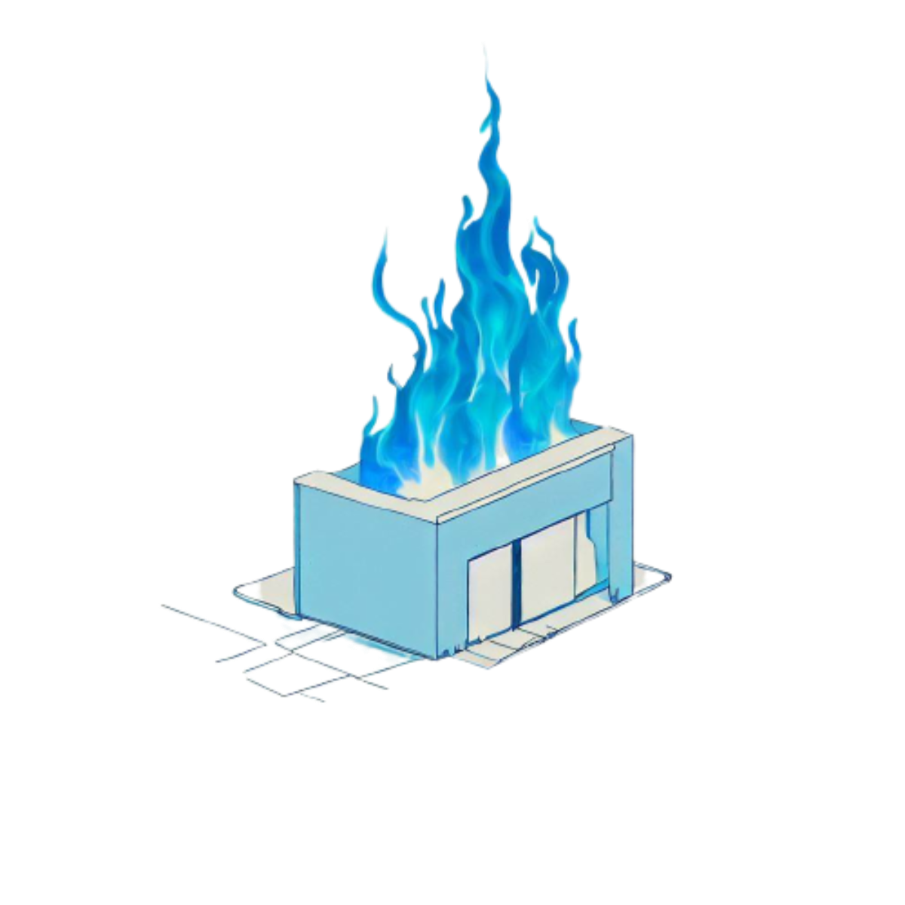

# Fireshop - Hugo with Svelte Web Components App


<!--  { width:"300px"; height:"200px"} -->

Fireshop is a powerful and dynamic e-commerce website template that combines the flexibility of Hugo and the interactivity of Svelte Web Components. This template allows you to build stunning online shops with blazing-fast performance and seamless user experiences. Whether you're a developer looking for an efficient way to create an e-commerce site or a business owner who wants to launch an online store, Fireshop has got you covered.

## Table of Contents

- [Live Site](#live-site)
- [Features](#features)
- [Project ToDo's](#project-todos)
- [Getting Started](#getting-started)
  - [Prerequisites](#prerequisites)
  - [Installation](#installation)
  - [Configuration](#configuration)
- [Usage](#usage)
- [Customization](#customization)
  - [Developing Components](#developing-components)
  - [Theming](#theming)
  - [Product Catalog](#product-catalog)
  - [API Integration](#api-integration)
- [Contributing](#contributing)
- [Discord sever](#discord-server)
- [License](#license)

## Live Site

You can view the [demo site](https://fire-shop.netlify.app)

## Features

- **Hugo**: Utilize the power of Hugo, a fast and flexible static site generator, to manage content and generate static pages efficiently.

- **Svelte Web Components**: Harness the interactivity and reactivity of Svelte to create dynamic user interfaces with ease.

- **Responsive Design**: Build a seamless shopping experience for users across various devices and screen sizes.

- **Product Management**: Easily manage your product catalog through Hugo's content management system.

- **Fast Loading**: Take advantage of Hugo's static site generation to achieve lightning-fast loading times.

- **SEO Optimization**: Generate SEO-friendly pages with Hugo's built-in features and best practices.

- **Custom Theming**: Customize the look and feel of your online store by easily modifying Hugo templates and Svelte components.

- **Data Fetching**: Fetch data from external APIs to display real-time product information and updates.

## Project TODO's

- [x] Revolt Merchant API's for customer notification
- [x] Supabase user authentication
- [x] Supabase Serveless edge functions
- [ ] Mpesa Payments
- [ ] Glovo or Sendy kenya delivery service

## Getting Started

### Prerequisites

Before you begin, ensure you have the following installed:

- **Hugo**: You can download and install Hugo from [Hugo's official website](https://gohugo.io/getting-started/installing/).

- **Node.js and npm**: Svelte requires Node.js and npm. You can download them from [Node.js official website](https://nodejs.org/).

### Installation

1. Clone the Fireshop repository:

   ```bash
   git clone https://github.com/SinoLewis/fireshop.git
   ```

2. Navigate to the project directory:

   ```bash
   cd fireshop
   ```

3. You own git dev branch (optional)

    ```bash
    git checkout -b your_dev_branch_name
    ```

4. Install the required Node.js dependencies:

   ```bash
   npm install
   ```

### Configuration

1. **Hugo Configuration**: Update the `config.toml` file in the root directory to configure your Hugo site settings, such as site title, description, and more.

2. **Svelte Configuration**: Modify Svelte components in the `src/components` directory to customize the user interface and functionality.

## Usage


- `npm start`: Main dev server. Runs everything you need.
- `npm run svelte`: Runs components in isolation. Serves `app/index.html` as a playground for components.
- `npm run hugo:serve`: Only runs static site.
- `npm run build`: Hugo & Svelte Build for production

This command will build and serve the Hugo site along with the Svelte components. Open your browser and navigate to `http://localhost:6969` to see your Fireshop in action!

## Customization

### Developing Components

Create a Svelte file in the `app/components` directory. It must have a custom element tag.

```html
<svelte:options tag="cart-info" />

<script>
  export let info: string;
</script>

<h1>Good cookup sesh! {info}</h1>
```

Export the component from `app/main.ts` as per [svelte docs](https://webcomponents.dev/docs/svelte):

```ts
export * from "./components/hi-mom.svelte";
```

Now use it in anywhere in your HTML or Markdown.

```html
<hi-mom greeting="i made a web component"></hi-mom>
```

**Note 1:** Web components styles are encapsulated through the [Shadow DOM](https://web.dev/shadowdom-v1/). Global styles will not work as part of Shadow DOM concept of styling.
**Note 2:** You can use Tailwind, with `@apply` in the component or the css used by [tailwindcss docs](https://v2.tailwindcss.com/docs).

### Theming

- You can customize the theme of your Fireshop by editing Hugo templates located in the `layouts` directory. 
- Styles can be found in the `styles` directory
- Components for the Svelte portion of the app can be found in the `src/components` directory.

### Product Catalog

Manage your product catalog by creating and editing content files in the `content/products` directory. You can utilize Hugo's content management system to easily add, remove, or update products.

### API Integration

To fetch real-time product information, integrate with external APIs by modifying Svelte components in the `src/components` directory. Use libraries like `fetch` or `axios` to make API requests.

## Contributing

We welcome contributions from the community! If you'd like to contribute to Fireshop, please review our [contribution guidelines](CONTRIBUTING.md).


## Discord server

## License

Fireshop is released under the [MIT License](LICENSE).

---

Feel free to reach out to us at [sinolewis@gmail.com](mailto:sinolewis@gmail.com) if you have any questions or need assistance. Happy e-commerce site building with Fireshop! 🛍️
